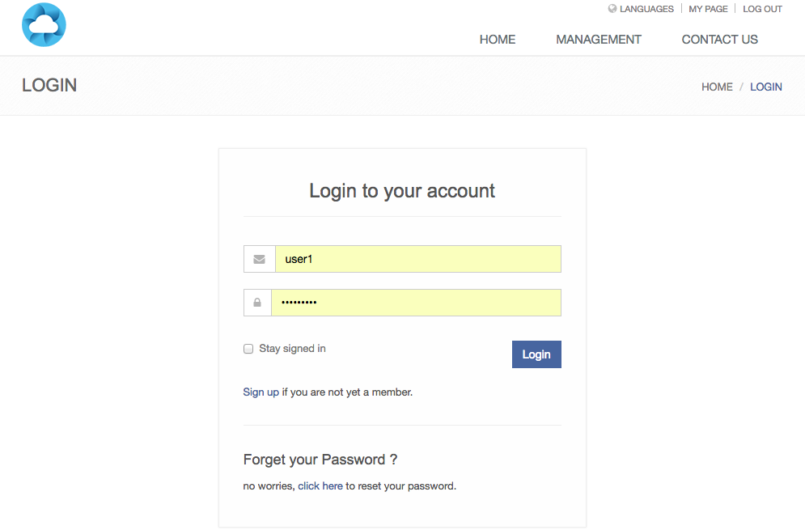
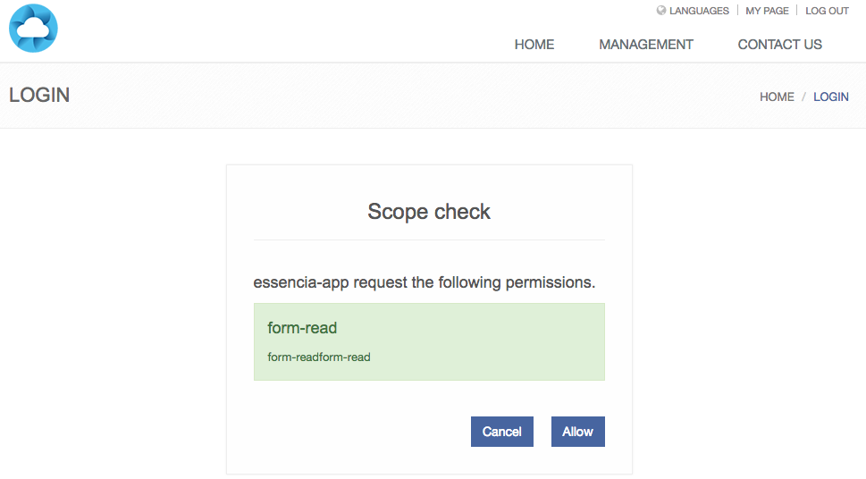
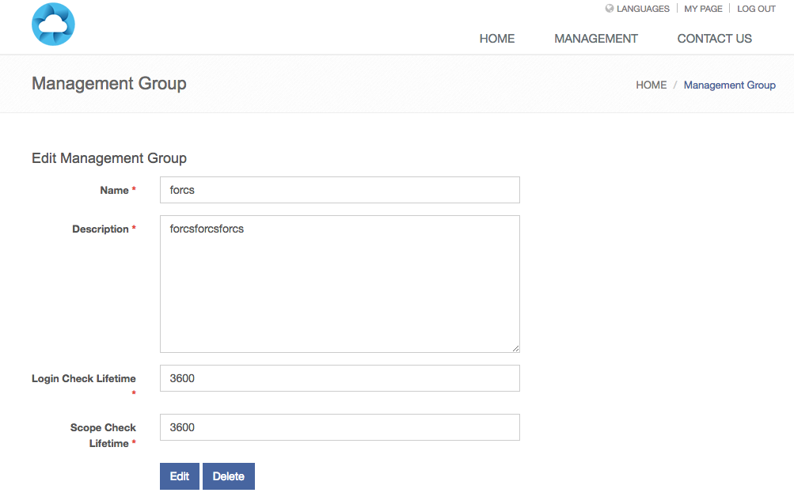
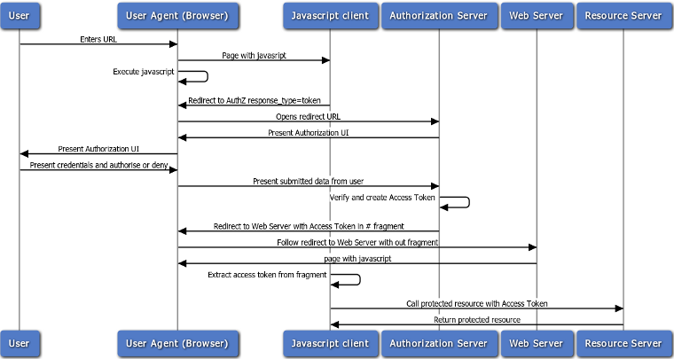
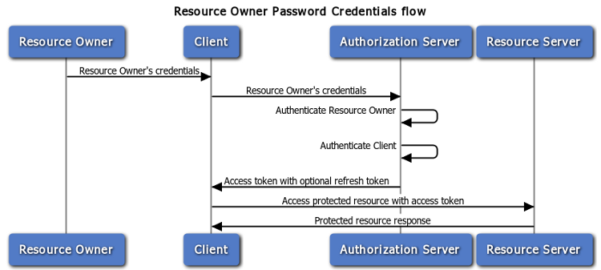

# OCE IAM

## Installation

## Tutorial

OCE IAM 의 Oauth Endpoint 는 다음으로 구성되어 있습니다.

| Endpoint             | 설명                   |
|----------------------|------------------------|
| /oauth/authorize     | 사용자 인증 url        |
| /oauth/access_token  | 어세스 토큰 발급 url   |
| /oauth/refresh_token | 어세스 토큰 재발행 url |
| /oauth/token_info    | 어세스 토큰 정보 조회  |

OCE IAM 의 Oauth2 인증 플로우는 Oauth2 프레임워크 표준 규약 RFC 문서를 바탕으로 제작되었습니다.

[The OAuth 2.0 Authorization Framework](https://tools.ietf.org/html/rfc6749#page-33)

### Authorization Code

Authorization Code 플로우는 제3자의 어플리케이션이 어세스토큰을 발급받는과정입니다. 어플리케이션의 입장에서는 서버사이드 코드가 필요하며, 
최초로 code 를 요청하고, code 를 사용해 access_token 로 교환할 때 client_secret (클라이언트 인증) 이 필요합니다.
 


#### Step 1
 
/oauth/authorize 로 GET 방식으로 접속합니다.

서버사이드 코드로 GET 접속하는것이 아닌, 사용자가 Agent(브라우저) 를 통하여 /oauth/authorize 로 접근되도록 유도합니다.

```
GET /oauth/authorize
```

| Parameter     | Type   | Requied  |
|---------------|--------|----------|
| client_id     | String | TRUE     |
| response_type | String | TRUE     |
| redirect_uri  | String | OPTIONAL |
| scope         | String | TRUE     |
| state         | String | OPTIONAL |


 - client_id : 클라이언트 아이디
 
 - response_type : 'code' 를 사용합니다.
 
 - redirect_uri : 사용자가 인증을 한 후 리턴되는 URI 입니다. IAM 콘솔에서 클라이언트에 Web Server Redirect Uri 값을 지정하지 않았다면 redirect_uri 을 필수적으로 넣어야 합니다.
 Web Server Redirect Uri 를 등재하였을 경우 redirect_uri 값과 미리 등재된 값이 같아야 합니다.
 
 - scope : 요청스코프 리스트를 ',' 로 구분하여 하나의 스트링으로 보내도록 합니다.
 
 - state : 사용자가 인증을 한 후 리턴되는 URI 에 이 값이 다시 들어오게 됩니다. 주로 클라이언트 배포자가 서비스 프로바이더로 부터 오는 호출을 구분짓기 위해 사용합니다.  
  
사용자를 위의 주소로 유도할 때 URI 인코드 된 주소로 호출하도록 합니다.

예)

```
http://localhost:8080/oauth/authorize?client_id=9a1e6155-c735-4986-b654-b1269a955666&response_type=code&scope=form-read&state=some_value&redirect_url=http://app.domain/some_redirect_url
```

#### Step 2

사용자를 브라우저를 통해 위의 주소로 유도하였을 경우 로그인 창이 열리고, 사용자는 로그인과 스코프 수락을 하게 됩니다.





이때, 사용자의 로그인과 스코프 체크 라이프타임을 설정할 수 있습니다.



예로, 0 으로 설정할 경우 매번 사용자의 로그인와 스코프 체크를 요구하게 되고, 3600 일 경우 1시간 내에 로그인과 스코프 체크 한 경우에 대하여 다시 묻지 않습니다.
 
#### Step 3

OCE IAM 은 입력받은 redirect_uri 로 GET 방식을 통해 code,state 값을 보내게 됩니다.

예)

```
http://app.domain/some_redirect_url?state=some_value&code=edc5f7e6-7f3f-4f97-94f0-87f6ca5370cd
```

만약 Step 1 단계에서 에러가 생겼으며, redirect_url 이 명시되어있을 경우 redirect_url 로 GET 방식으로 에러메세지가 전송됩니다.

예)

```
http://app.domain/some_redirect_url?error=access_denied&error_description=requested code has expired&state=some_value
```

에러 타입:

 - invalid_request
 
 - invalid_token
 
 - unauthorized_client
 
 - access_denied
 
 - unsupported_response_type
 
 - unsupported_grant_type
 
 - invalid_scope
 
 - server_error
 
 - temporarily_unavailable
 
error_description 필드에 보다 자세한 Human-readable ASCII text 형식의 상황설명을 살필 수 있습니다.


#### Step 4

어플리케이션 제작자는 해당 redirect_url 에서 GET 으로 위의 파라미터를 받은 후, code 를 통해 access_token 을 요청받는 로직을 구현하여야 합니다.

```
POST http://localhost:8080/oauth/access_token

-- header "Content-Type: application/x-www-form-urlencoded"
```

| Parameter     | Type   | Requied  |
|---------------|--------|----------|
| client_id     | String | TRUE     |
| client_secret | String | TRUE     |
| grant_type    | String | TRUE     |
| redirect_uri  | String | OPTIONAL |
| code          | String | TRUE     |

 - client_id : 클라이언트 아이디
 
 - client_secret : 클라이언트 시크릿
 
 - grant_type : 'authorization_code' 를 사용합니다.
 
 - redirect_uri : Web Server Redirect Uri 값을 지정하지 않았다면 redirect_uri 을 필수적으로 넣어야 합니다. Web Server Redirect Uri 를 등재하였을 경우 redirect_uri 값과 미리 등재된 값이 같아야 합니다.
 
 - code : 전달받은 코드
  
  
정상적으로 인증을 받을 경우 다음의 리스폰스를 받을 수 있습니다.

```
Response

Status 200

{
  "expires_in": 3600,
  "token_type": "Bearer",
  "refresh_token": "efb59b36-2ba0-4137-90de-fb33cd232e7d",
  "access_token": "500de888-ac56-4421-9557-deb34f59dc17"
}
```


에러시에는 400 으로 응답이 오며, 각 상황의 error 필드 문구는 다음과 같습니다.

```
Error Response

Status 400

ex)
{
  "error": "access_denied",
  "error_description": "requested code has expired."
}
```

 - invalid_request
 
 - invalid_token
 
 - unauthorized_client
 
 - access_denied
 
 - unsupported_response_type
 
 - unsupported_grant_type
 
 - invalid_scope
 
 - server_error
 
 - temporarily_unavailable
 
error_description 필드에 보다 자세한 Human-readable ASCII text 형식의 상황설명을 살필 수 있습니다.


### Implicit Grant Flow

Public Client 인 브라우저 기반의 어플리케이션(Javascript application)이나 모바일 어플리케이션에서 이 방식을 사용하는 것을 추천합니다. 
Client 증명서를 사용할 필요가 없습니다.



#### Step 1
 
/oauth/authorize 로 GET 방식으로 접속합니다.

서버사이드 코드로 GET 접속하는것이 아닌, 사용자가 Agent(브라우저) 를 통하여 /oauth/authorize 로 접근되도록 유도합니다.

```
GET /oauth/authorize
```

| Parameter     | Type   | Requied  |
|---------------|--------|----------|
| client_id     | String | TRUE     |
| response_type | String | TRUE     |
| redirect_uri  | String | OPTIONAL |
| scope         | String | TRUE     |
| state         | String | OPTIONAL |


 - response_type : 'token' 를 사용합니다.
 
 - 그 외에는 Authorization Code 요청과 동일합니다.
  
  
사용자를 위의 주소로 유도할 때 URI 인코드 된 주소로 호출하도록 합니다.

예)

```
http://localhost:8080/oauth/authorize?client_id=9a1e6155-c735-4986-b654-b1269a955666&response_type=token&scope=form-read&state=some_value&redirect_url=http://app.domain/some_redirect_url
```

#### Step 2

Authorization Code 와 마찬가지로 사용자의 로그인 및 스코프 체크 절차를 진행하게 됩니다.
 
#### Step 3

OCE IAM 은 입력받은 redirect_uri 로 GET 방식을 통해 scope,state,expires_in,token_type,access_token 값을 보내게 됩니다.

예)

```
http://app.domain/some_redirect_url?scope=form-read&state=null&expires_in=3600&token_type=Bearer&access_token=12d1270b-0b7a-430e-adb0-3839c9a9e2e4
```

위 과정에서 생긴 에러는 redirect_url 을 통해 GET 방식으로 에러메세지가 전송되게 됩니다.

에러 타입은 Authorization Code 와 동일합니다.

### Resource Owner Password Credentials Flow

2-legged 방식의 인증입니다. Client 에 아이디/패스워드를 저장해 놓고 아이디/패스워드로 직접 access token 을 받아오는 방식입니다. 
Client 를 믿을 수 없을 때에는 사용하기에 위험하기 때문에 API 서비스의 공식 어플리케이션이나 믿을 수 있는 Client 에 한해서만 사용하도록 합니다.




어플리케이션 제작자는 사용자의 아이디,패스워드를 POST 전송하여 access_token 을 받을 수 있습니다.

```
POST http://localhost:8080/oauth/access_token

-- header "Content-Type: application/x-www-form-urlencoded"
```

| Parameter     | Type   | Requied  |
|---------------|--------|----------|
| client_id     | String | TRUE     |
| client_secret | String | TRUE     |
| grant_type    | String | TRUE     |
| username      | String | TRUE     |
| password      | String | TRUE     |
| scope         | String | OPTIONAL |

 - client_id : 클라이언트 아이디
 
 - client_secret : 클라이언트 시크릿
 
 - grant_type : 'password' 를 사용합니다.
 
 - username : 인증받을 사용자의 아이디
 
 - password : 인증받을 사용자의 패스워드
 
 - scope : 스코프
  
  
정상적으로 인증을 받을 경우 다음의 리스폰스를 받을 수 있습니다.

```
Response

Status 200

{
  "expires_in": 3600,
  "token_type": "Bearer",
  "refresh_token": "183bb8d0-1a96-42eb-a600-d1a4625007f7",
  "access_token": "789424ea-5363-46d2-8e49-65e27ce077bb"
}
```


에러시에는 400 으로 응답이 오며, 각 상황의 error 필드 문구는 다음과 같습니다.

```
Error Response

Status 400

ex)
{
  "error": "access_denied",
  "error_description": "requested code has expired."
}
```

 - invalid_request
 
 - invalid_token
 
 - unauthorized_client
 
 - access_denied
 
 - unsupported_response_type
 
 - unsupported_grant_type
 
 - invalid_scope
 
 - server_error
 
 - temporarily_unavailable
 
error_description 필드에 보다 자세한 Human-readable ASCII text 형식의 상황설명을 살필 수 있습니다.


### Client Credentials Grant Flow

어플리케이션 이 Confidential Client 일 때 client_id 와 client_secret 을 가지고 인증하는 방식입니다. 사용자 인증방식이 아닌, 어플리케이션 자체가 서비스 프로바이더의
 API 리소스를 사용하는데 제약을 걸기 위해 쓰입니다.


어플리케이션 제작자는 클라이언트 키,시크릿을 POST 전송하여 access_token 을 받을 수 있습니다.

```
POST http://localhost:8080/oauth/access_token

-- header "Content-Type: application/x-www-form-urlencoded"
```

| Parameter     | Type   | Requied  |
|---------------|--------|----------|
| client_id     | String | TRUE     |
| client_secret | String | TRUE     |
| grant_type    | String | TRUE     |
| scope         | String | OPTIONAL |

 - client_id : 클라이언트 아이디
 
 - client_secret : 클라이언트 시크릿
 
 - grant_type : 'client_credentials' 를 사용합니다.
 
 - scope : 스코프
  
  
정상적으로 인증을 받을 경우 다음의 리스폰스를 받을 수 있습니다.

```
Response

Status 200

{
  "expires_in": 3600,
  "token_type": "Bearer",
  "refresh_token": "183bb8d0-1a96-42eb-a600-d1a4625007f7",
  "access_token": "789424ea-5363-46d2-8e49-65e27ce077bb"
}
```


에러시에는 400 으로 응답이 오며, 각 상황의 error 필드 문구는 다음과 같습니다.

```
Error Response

Status 400

ex)
{
  "error": "access_denied",
  "error_description": "requested code has expired."
}
```

 - invalid_request
 
 - invalid_token
 
 - unauthorized_client
 
 - access_denied
 
 - unsupported_response_type
 
 - unsupported_grant_type
 
 - invalid_scope
 
 - server_error
 
 - temporarily_unavailable
 
error_description 필드에 보다 자세한 Human-readable ASCII text 형식의 상황설명을 살필 수 있습니다.

## REST API

OCE IAM 의 /rest/console 주소를 통하여 살펴볼 수 있습니다.

